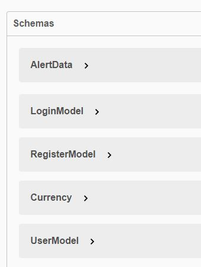
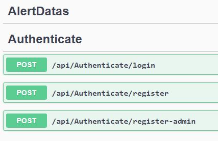
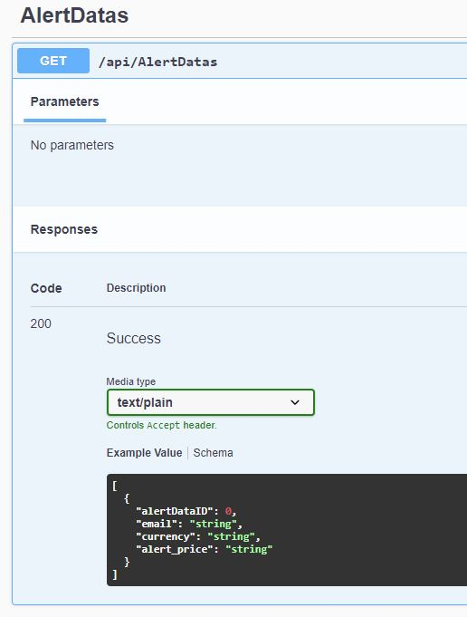
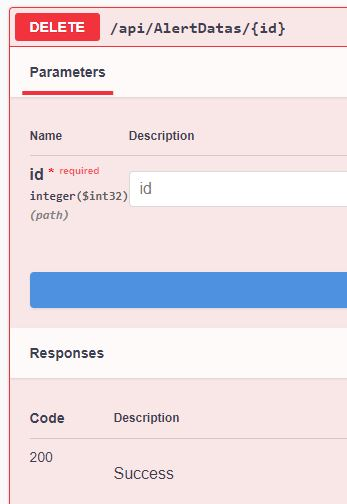
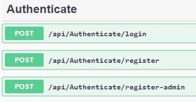
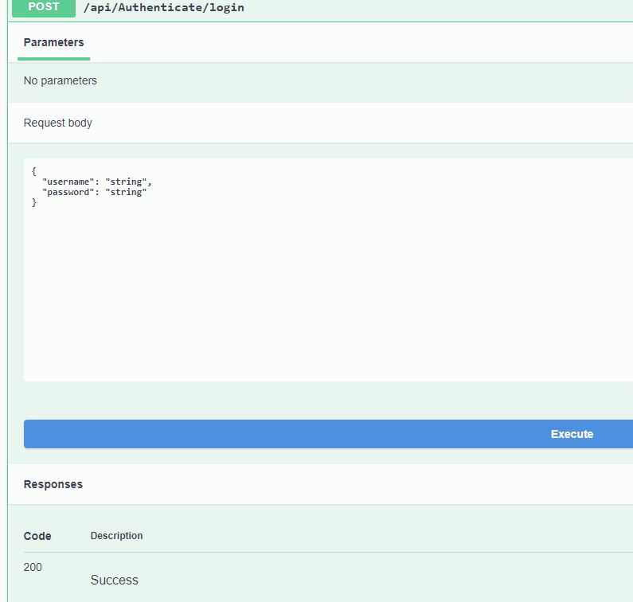
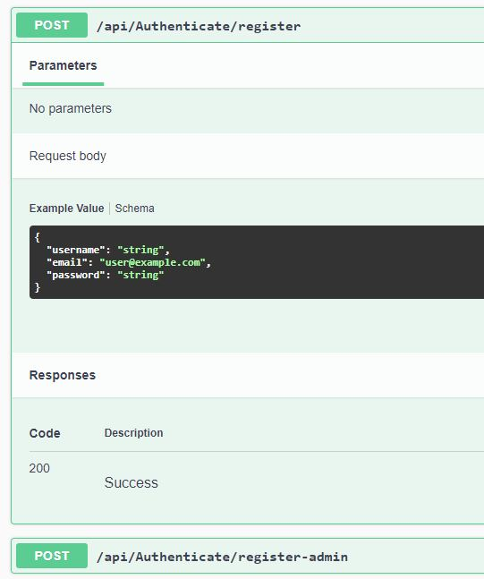

# AlertAPI
3 schemas are made AlertDatas ,registerModel,UserModel  

AlerData has 3 endpoints 
get-to get alert data
post- to set new alert
delete -to delete the set alert  

Alertdatas/get  

Alertdatas/delete  

Authenticate for user authentication  

 
 
 Anuj Gupta
 18BCE10044
