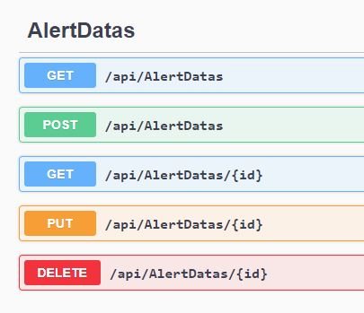

# AlertAPI

This API is prepared in dot net Core 5.0 using visual studio 2019.

C# language is used for API development.

JWT authentication token system is used for user authentication.

We prepared one model class AlertData where email,currecny and alert price is posted by the user by post API /api/aleretdata/ with data in body.

One service backgroundprinter runs in the background whiche is inherited by IHostedService that runs in every 5 minutes.

It gets data by calling API for currency current price and then compare with alert price.  If alert price is crossed then it send one Email to that user.

For sending Email I used EmailSender class which is inherited from dot net core inbuilt class IEmailSender .

SMTP parameters are set in appsetting.json file for sendinfg Email.

<strong>Procedure to run the API</strong>

<strong>1.&nbsp;</strong>Run solution file CryptoCurrencyAlert.sln in visual studio.

2. Then create database by using update-database command in Package Manager console.

3. Run project in&nbsp; IIS express.

4.Then create username by using API post endpoint&nbsp; /api/authentication/register.

5. then login by same username and password using post endpoint /api/authentication/login.

6. Now post&nbsp; your alert price by using endpoints /api/alertdatas/ with alertdata data in body in json format.

7. Now background process will send Email if alert price is crossed.

3 schemas are made AlertDatas ,registerModel,UserModel  

AlerData has 3 endpoints 
get-to get alert data
post- to set new alert
delete -to delete the set alert  

Alertdatas/get  

Alertdatas/delete  

Authenticate for user authentication  

 
 
 Anuj Gupta
 18BCE10044
